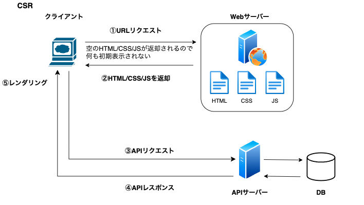
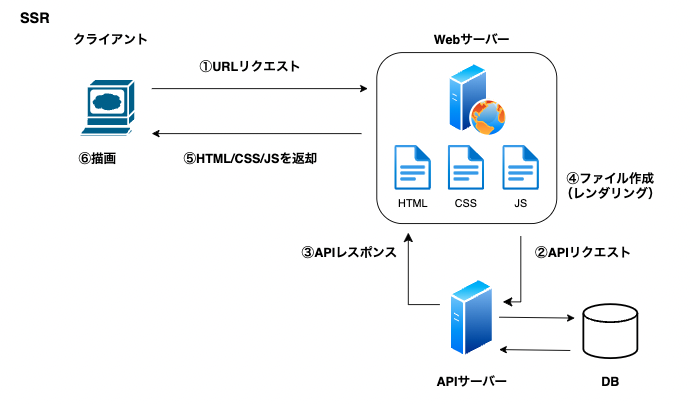
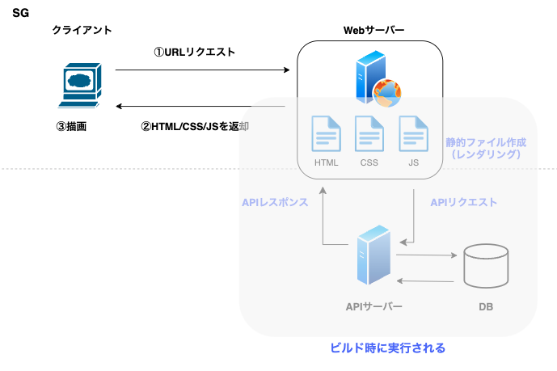
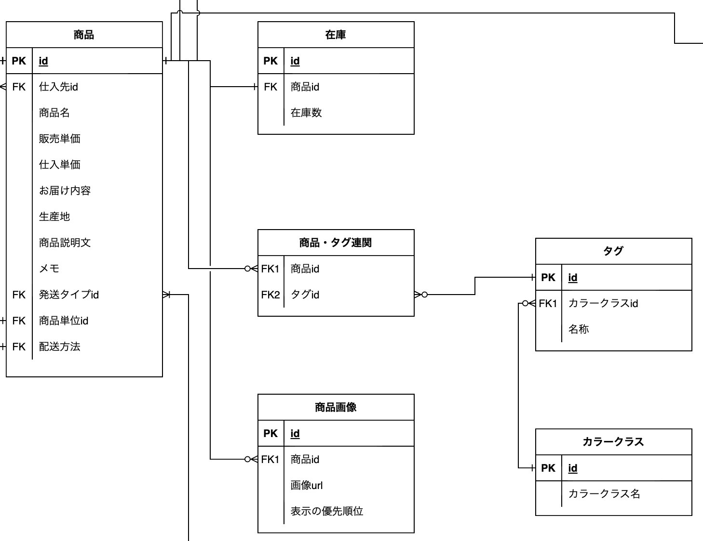

# 目次

<!-- TOC -->

- [目次](#目次)
- [1. 概要](#1-概要)
- [2. 方針](#2-方針)
- [3. Web 開発](#3-web-開発)
  - [3.1 フロントエンド](#31-フロントエンド)
    - [概要](#概要)
    - [技術スタック](#技術スタック)
    - [開発環境](#開発環境)
    - [レンダリングの種類](#レンダリングの種類)
      - [CSR](#csr)
      - [SSR](#ssr)
      - [SG](#sg)
    - [ハイドレーション](#ハイドレーション)
    - [フロントエンドにおけるログの話](#フロントエンドにおけるログの話)
    - [Web ストレージ](#web-ストレージ)
      - [Local Storage](#local-storage)
      - [Session Storage](#session-storage)
      - [Cookie](#cookie)
      - [インメモリ](#インメモリ)
  - [3.2 バックエンド](#32-バックエンド)
    - [概要](#概要-1)
    - [通信手段](#通信手段)
    - [技術スタック](#技術スタック-1)
    - [API 設計](#api-設計)
      - [エンドポイントの設計](#エンドポイントの設計)
      - [クエリパラメーターとパスパラメーター](#クエリパラメーターとパスパラメーター)
    - [HTTP ヘッダ](#http-ヘッダ)
    - [HTTP レスポンス](#http-レスポンス)
    - [HTTP ステータス](#http-ステータス)
  - [3.3 データベース](#33-データベース)
    - [概要](#概要-2)
  - [3.4 インフラ](#34-インフラ)
    - [概要](#概要-3)
    - [IaC（Infrastructure as Code）](#iacinfrastructure-as-code)
- [4. バリデーションについて](#4-バリデーションについて)
  - [4.1 フロントエンドのバリデーション](#41-フロントエンドのバリデーション)
  - [4.2 バックエンドのバリデーション](#42-バックエンドのバリデーション)
  - [4.3 データベース](#43-データベース)
- [5. 実際の開発](#5-実際の開発)
- [その他](#その他)
  - [情報収集について](#情報収集について)
  - [読んだ良かった書籍](#読んだ良かった書籍)

<!-- /TOC -->

# 1. 概要

- 本書は、Web アプリケーションの設計・開発を実施する前に最低限必要となる内容を記載している。
- なお、内容に関しては筆者の知見に基づくものであり、偏りなどがあるため、予めご容赦いただきたい。

<br />

# 2. 方針

- 本書を通じて、知識のインプットを実施し、別の講座にて簡易的な Web アプリケーション構築をベースにアウトプットを図る方針とする。

<br />

# 3. Web 開発

- 近年の Web アプリケーション開発では、フロントエンドとバックエンド（サーバーサイド）を分離して開発することが主流となっている
  - 責務を分離する
  - 開発体制の分離（一長一短）
  - 疎結合
    - リリースしやすい
    - テストがしやすい

<br />

- 設計・開発は、Web エンジニア（＝ Web で動作するアプリケーションの設計・構築をおこなうエンジニア）がおこなっている

<br />

## 3.1 フロントエンド

### 概要

- Web アプリケーションでユーザーの目に触れる部分を担当する
- 画面の UI/UX は、フロントエンドエンジニアが担当する場合もあるが、最近の Web 開発では、デザインツール（Figma、XD）を活用してデザイナーが担当し、フロントエンドエンジニアと協業しながら設計・開発を進めることが主流である

<br />

### 技術スタック

- Web 領域の進化はされているが、HTML/CSS/JavaScript の 3 つの技術が根底にあることは今も変わっていない
- ただし、最終的には上述の 3 つにトランスパイルされるが、ライブラリ、フレームワークを活用した開発が主流となっている

<br />

表 1：代表的なライブラリとフレームワーク
| ライブラリ | フレームワーク |
| ---------------- | --------- |
| React.js | Next.js |
| Vue.js | Nuxt.js |
| Angular | - |

<br />

- あくまで筆者の市場観測に過ぎないが、現在（2023.1）は、Meta 社（Facebook）が提供する React.js を選定することが多いように見受けられる
  - また、フレームワークとしても Vercel 社が提供する Next.js がデファクトとなっており、React/Next の組み合わせを選定することが多い
- 2019~2020 あたりは、Vue.js の勢いが強く、Vue2/Nuxt の選定を多く見ることがあったが、Vue3 をきっかけに React への移行や回帰といったことが起きたと思っている
  - ただし、Nuxt3 も発表されており、Vue3/Nuxt3 による選定も筆者としては興味があり、機会があれば活用してみたいと思っている
- フロントエンド界隈は、技術の進化が早い特徴があるため、半年前まで使っていた技術が廃れてしまうということもザラにあるので、日々の情報収集は他よりも必要になってくる
- 毎年更新されている[ロードマップ](https://roadmap.sh/frontend)を参照すると現在を知ることができる

<br />

### 開発環境

- IDE としては、MS が提供する[VSCode](https://azure.microsoft.com/ja-jp/products/visual-studio-code)を使用することがデファクトとなっており、コードを書いたらブラウザ（Chrome など）で動作確認をしながら実装する
  - 余談であるが、やっと IE11 から解放されたので IE の独自対応をする必要がなくなったのは大きい
- 昔はコードを書いてファイルを変更したらブラウザをいちいちリロードしなければならなかったが、変更を検知する仕組み（＝ホットリロード）が組み込まれているのが一般的となっているので、開発者体験が向上している

<br />

### レンダリングの種類

- レンダリングとは、HTML/CSS/JavaScript を組み合わせてレンダリングツリーの構築すること
  - 空の HTML に対して、JavaScript でコンテンツ（インタラクション）を付与して、CSS のスタイリングをしたファイル

#### CSR

- Client Side Rendering

  - クライアントサイドでのレンダリング
  - クライアント（ブラウザ）からのリクエストに対して、空の HTML と JavaScript を返却して、クライアントサイドにて JavaScript を実行してページ全体を生成する
    - SPA（Single Page Application）
      - ひとつの Web ページを読み込んで別の内容を表示する場合には、JavaScript を通じて内容を更新する
    - MPA（Multi Page Application）
      - 従来の Web アプリでよくある別の内容を表示するには、サーバーへリクエスト（リロード）が必要
  - CSR 図解

    

#### SSR

- Server Side Rendering

  - サーバーサイドレンダリング
  - CSR では、初回レンダリングが重いという（最近は全然感じることはありません）課題を解決するためにリクエストを受けたサーバーサイドで動的に HTML を作って返却する方式
  - サーバーサイドでレンダリングするということは実行環境が必要となる。つまり、JavaScript の実行環境である Node.js が必要となる
  - 実例としては、外部の API をコールする場合に、HTTP ヘッダなどに認証用 API キーの付与が必要となる場合がある。該当の API を CSR からコールした場合には、デベロッパーツールで API キーが丸見えになってしまうので、サーバーサイドで API をコールするようにしている
  - SEO に強い
    - Google などの検索エンジンは、クローラー（検索エンジンが検索の順位を決めるための要素をサイトから収集してくるロボット）を使って Web サイトを巡回している
    - SPA の場合には CSR なので後からデータを取得することから少し時間がかかることから、クローラーが待ってられずデータを取得できない
    - データが取得できなければ、コンテンツが充実していないページと認識されてしまう
    - コンテンツが充実していないと検索上位に表示されることはないので、結果的に SPA の仕組み的に SEO に弱いと言われている
    - SSR の場合には、サーバーサイドでデータの取得を取得し、HTML を生成するのでクローラーも Web ページを読み取ることができるので SEO に強いと言われている
  - SSR 図解

    

#### SG

- Static Generation

  - 以前は、SSG（Static Site Generating）と呼ばれていた
  - 事前に静的な HTML を作成してしまおうという仕組み
  - Next.js では、ビルド時に SG の HTML を生成する機構が入っており、生成した HTML は Web サーバーでキャッシュしている
  - クライアントからリクエストがあったら、キャッシュから生成しておいたレスポンスを返却するので早い
  - SSR 同様にクローラーが読み取れるので SEO に強い
  - ほとんど変更されないページ（ブログ記事や商品詳細など）を SG にすることがある
  - 逆にリアルタイムで更新ができない
  - SG 図解

    
    <br />

### ハイドレーション

- SSR に関連する用語であり、サーバーサイドで React などの DOM を構築して、クライアントへ返却することになるが、クライアントで読み込んだ際にコンポーネントに対して後からイベントリスナー（クリック時のアクション）を足すようなもの
- [New Suspense SSR Architecture in React 18](https://github.com/reactwg/react-18/discussions/37)

<br />

### フロントエンドにおけるログの話

- フロントエンドでシステム上の例外をハンドリングしてログに残したい場合はどうするか？
  - フロントエンドはブラウザで動くので、`console.log('xxx error.')`としたとしてもシステム管理者側では検知できない（デベロッパーツールの console タブに出力されるだけ）
  - ログ管理（分析や監視）したい場合には、従来ではバックエンドでログ登録用の API を用意して、フロントエンドから該当の API をコールして、サーバー側でロギングする方式がある
  - 同じ原理であるが、Next.js などの FW では、API ルートを備えているので、ログ API を作って（BFF としての役回り）、フロントエンドからログ API をコールすることでホスティングされたフロントエンドのサーバー配下にログを出力することができる
    - 余談ではあるが、昨今では、アプリケーションをコンテナ（Docker）で稼働させることが多くなってきており、ログは物理ファイルではなく標準出力（コンソール出力）させることが多い

<br />

### Web ストレージ

- キーとバリューの組み合わせでブラウザでデータを保持することができる（Web ブラウザ内でのデーターベースをイメージすると良い）

#### Local Storage

- ブラウザ、ウィンドウを閉じてもデータが消えない（永続化できる）
- フロントエンドのみで操作できる
- [オリジン](https://developer.mozilla.org/ja/docs/Glossary/Origin)が同じであれば、同一のローカルストレージに保管される
- トークン、ユーザー情報などの機密性の高いデータは保管すべきではないと言われている
- 保持期限がないので、削除する制御を含めないと蓄積されてしまう
- XSS 攻撃を受ける場合がある（JavaScript でアクセスできてしまうため）
  - 攻撃を受けるとストレージのデータを取得されて、攻撃を仕掛けたサーバーに送信されてしまう
- 筆者は、例えばリダイレクト前に訪問した URL の一時保存や処理のステップ値などをユースケースに応じて活用するようにしている
  - データベースに保存するほどではなく、ページをリロードしてもデータを保持しておきたいユースケースなどで活用する

<br />

#### Session Storage

- ブラウザ、ウィンドウを閉じるとデータが消える
- フロントエンドのみで操作できる
- ローカルストレージ同様に、オリジンが同じであれば、保管場所は同じである
- トークン、ユーザー情報などの機密性の高いデータは保管すべきではないと言われている
- XSS 攻撃を受ける場合がある（JavaScript でアクセスできてしまうため）
  - 攻撃を受けるとストレージのデータを取得されて、攻撃を仕掛けたサーバーに送信されてしまう
- アプリケーションが別のウィンドウで開いた場合に互いを干渉したくない場合に利用する

<br />

#### Cookie

- フロントエンド・バックエンド両方で操作できる
- 有効期限を決めることができる
- HTTP のみとすれば、JavaScript ではアクセスできないため、XSS 攻撃を制限できる（完全武装ではない）
- トークン情報などを HTTP Only で保管することに活用される
- ログイン状態の保持やユーザー行動のトラッキング記録

<br />

#### インメモリ

- フロントエンドのみで操作できる
- アプリケーション内部でグローバルで持つ変数（Vue/React でいうと store で管理されているグローバル state）なので、リロードすると消える（ブラウザ、ウィンドウを閉じても消える）
- ページ間、コンポーネントを跨いで状態を管理したい場合に使用する
- トークンの保存先として、ローカル、セッションストレージではセキュリティ面で厳しく、Cookie も攻撃される可能性があり、インメモリにするとリロードすると消えたり、タブ間での共有ができないことから[Auth0](https://auth0.com/jp)と認証サービスでは、インメモリでトークンを永続化する機構を持っているので、最近では導入しているプロダクトをよく見る
  - [参考記事](https://logmi.jp/tech/articles/324349)

<br />

## 3.2 バックエンド

### 概要

- クライアント（フロントエンドなど）からのリクエスト要求を受けて、必要に応じてデータベースへアクセス、ビジネスロジックの処理を担当する。取得要求の場合には、JSON にてデータを返却することがデファクトである

<br />

### 通信手段

- HTTP 通信を使って、クライアントとサーバー間でデータの送受信をおこなうことが一般的である
  - HTTP メソッドは、取得（GET）、登録（POST）、更新（PUT）、削除（DELETE）を主に活用する
- リアルタイム性を求める場合には、サーバーからクライアントに対して PUSH する方式である WebSocket 通信を活用することがある（チャットアプリなど）
  - ハンドシェイクをおこない、コネクションを確立している間には、サーバーから接続されているコネクションに対して、メッセージを post することができる

<br />

### 技術スタック

- API 開発がデファクトであり、C#、PHP、Ruby、Python、Golang、Java、Kotlin、TypeScript あたりの言語を選定することが多い

<br />

表 2：代表的な開発言語・フレームワーク・ORM
| 言語 | フレームワーク | ORM |
| ---------------- | --------- |--------- |
| C# | .NET Framework / ASP.NET | ？ |
| PHP | Laravel | Eloquent |
| Ruby | Ruby on Rails | Active Record |
| Python | Django REST framework / Flask | |
| Golang | Echo / Gin | Gorm |
| Java | Spring | MyBatis / Doma2 / JPA |
| Kotlin | Spring | MyBatis / Exposed |
| TypeScript | Express / NestJS | TypeORM / Prisma |

<br />

- 筆者が経験や知見が乏しい部分は市場と異なる部分はあるかと思うが、実体験や市場を観測してみると表 2 の選定を見ることが多い
- なお、推測も含まれているが、業務系アプリケーション開発や金融系は古くから実績のある Java を利用し続けるあるいは選定しているかと思われる
- 一方、スタートアップのベンチャー企業は、0→1 で高速で作るには、`PHP／Laravel` or `Ruby on Rails` を選定しローンチしたら、グロース期に`Golang`へ書き換えるプロダクトを最近はよく見る
  - メルカリも最初は PHP で開発し、その後は Golang へ移行していたり、ミドル/メガベンチャーでも Java から Golang、サーバサイド Kotlin、あるいはフロントもバックエンドも TypeScript を選定しているプロダクトも目にする
- 選定に際しては、流行っているからとかそういった理由ではなく、開発するシステム仕様・ドメイン、保守性、技術者が集まりやすいか ...といったことを鑑みた上で選定すべきである
- バックエンドについても[ロードマップ](https://roadmap.sh/backend)を参考にすると良い

<br />

### API 設計

- API とは
  - Application Programming Interface の略であり、機能やデータを外部から呼び出して利用できるようにした規約のこと
- WebAPI とは
  - Web アプリケーションが提供する機能やデータを外からプログラムが読み取りやすい形で利用できるように定めた規約あるいは実装のこと
- RESTful とは
  - `RE`presentational `S`tate `T`ransfer の頭文字を取っている
  - REST で求められる原則に従っていること（設計ルール）

<br />

#### エンドポイントの設計

- システム内で一意にする必要がある
- 命名は自由であるが、人が読んで理解できるようにする
- 名詞を使う
- 全て小文字に統一した方が良い
- 単語はハイフンで繋ぐ

  - ただし、クエリパラメーターはキャメルケースが良い

- ex
  - `/api/v1/users`
  - `/api/v1/users/admin`
    - 筆者は api から始めてバージョン番号の後にリソース名を付与するように命名している
    - リソース名（ex では、users の部分）を単数系、複数形どちらにするか理論があるが、筆者はあまり気にしていない（どちらでも良いと思っている）

<br />

#### クエリパラメーターとパスパラメーター

- クエリパラメーター

  - URL の末尾にある`?`に続くキーバリュー値であり、複数指定する場合には`&`で繋ぐ
  - 検索条件を指定する場合に活用されることが多い。絞り込み条件は省略可能である。
  - ex
    - `/api/v1/search?q=1位&sortType=SORT_001`
    - 筆者はクエリパラメーターに関しては、キャメルケースを使うようにしている

- パスパラメーター
  - URL 中に埋め込まれるパラメーター
  - id など URI のパスに動的にマッピングしたい場合に利用する
  - ex
    - `/api/v1/users/10`
      - 10 の部分に`userId`をマッピングする設計

<br />

### HTTP ヘッダ

- API サーバーに対する追加情報を送信する
- クライアントのブラウザ情報、送信データのフォーマット、認証トークン、Cookie 情報 ... といった内容が含まれる（後述）

```
Host: localhost:3003
Origin: http://localhost:3737
Referer: http://localhost:3737/
User-Agent: Mozilla/5.0 (Macintosh; Intel Mac OS X 10_15_7) AppleWebKit/537.36 (KHTML, like Gecko) Chrome/108.0.0.0 Safari/537.36
authorization: Bearer abcd123xxxx
content-type: application/json
```

- Authorization
  - 認証用のトークンを付与するのが一般的
  - Bearer 認証（ベアラー）の場合には、`Bearer <トークン>`として指定する
- Content-Type

  - 送信データのフォーマットを指定する
  - JSON を送信する場合には、`application/json`を指定し、フォーム送信の場合には、`application/x-www-form-urlencoded`を指定する

- リクエストボディー
  - 登録/更新/削除をリクエストする場合には、パラメーターを request body にセットする
  ```
  {
    mailAddress: "taro@exapmple.com",
    name: "Taro Yamada"
  }
  ```

<br />

### HTTP レスポンス

- API リクエストに対して、API サーバーからレスポンスが返却される
- クライアントでは、レスポンスステータスに応じた処理制御（後述するエラーステータスであれば、適切なエラーハンドリング（準正常系、異常系）を実装する
- 筆者はプロパティ名はキャメルケース、配列の場合には認知しやすいようにプロパティ名は複数形あるいは末尾に List を付与するようにしている

```
{
  "browseHistories": [
    {
      "id": 1,
      "categoryList": [
        {
          "id": 4,
          "categoryNameEn":
          "seasoning",
          "categoryNameJa": "調味料"
        }
      ],
      "name": "紘二朗黒糖（固形）",
      "sellingPrice": 1063,
    }
  ],
  "totalCount": 3
}
```

<br />

### HTTP ステータス

- API サーバーからレスポンスが返却された際にステータスコードも返却される
- 設計や実装をすることで自然とソラで言えるようになるが、頻出するステータスは頭に入れておきたい
  - 外部の API を利用する際には、HTTP ステータスコードを見て原因を特定する必要がある
  - 自分たちで構築するシステムは絶対に以下のステータスコードを付与しなければならないわけではないが、結果に応じて適切なステータスコードを返却するように設計・実装すべきではある
- 詳細は[こちら](https://developer.mozilla.org/ja/docs/Web/HTTP/Status)

  **分類**
  | HTTP ステータスコード | 内容 |
  | ---- | ---- |
  | 200 番台 | 成功レスポンス |
  | 400 番台 | クライアント起因のエラーレスポンス |
  | 500 番台 | サーバー起因のエラーレスポンス |

  **200 番台**
  | HTTP ステータスコード | 説明 |
  | ---- | ---- |
  | 200 OK | リクエスト成功 |
  | 201 Created | 作成されたリソースのデータを返す |
  | 204 No Content | 登録したが、返却するレスポンスがない場合に返す |

  **400 番台**
  | HTTP ステータスコード | 説明 |
  | ---- | ---- |
  | 400 Bad Request | リクエストが不正。バリデーションエラー時に使用する |
  | 401 Unauthorized | 認証失敗。ログインできない場合に使用する |
  | 403 Forbidden | アクセス拒否。権限がない場合（API 認可など）に使用する |
  | 404 Not Found | リクエストがあったリソースがない |
  | 409 Conflict | リソースの競合。排他制御エラー時に使用する |

  **500 番台**
  | HTTP ステータスコード | 説明 |
  | ---- | ---- |
  | 500 Internal Server Error | サーバー内部でのエラー |
  | 502 Bad Gateway | 不正なゲートウェイ |
  | 503 Service Unavailable | サービス利用不可。システムメンテナンス時に使用する |
  | 504 Gateway Timeout | タイムアウト。サーバーからレスポンスがなくタイムアウトした場合に使用する |

<br />

## 3.3 データベース

### 概要

- データベースは、バックエンドの領域に含まれる
- ほとんどのシステムでデータベースは必要なので、エンジニアである以上、必須の知識である
- 最初からテーブル設計はハードルが高いため、まずは ER 図を見てテーブル間のリレーションを把握し、SQL で CRUD（登録・参照・更新・削除）がスラスラ書けるようになるべきである
- データベースは、RDBMS、NoSQL に分類される
  - RDBMS
    - SQL Server
    - MySQL
    - PostgreSQL
    - Oracle
  - NoSQL
    - MongoDB <- ドキュメントデータベース
    - Cassandra <- グラフデータベース

<br />

- RDBMS のテーブル設計

  - 1 対 1、1 対多、多対多のテーブル例
    

  <br />

  - テーブルのキーは、以下の 2 ついずれかを設定する（アプリケーションの規模や仕様、設計者の好みによって変わる）
    - サロゲートキー
      - 業務上は意味を持つ値ではないが、システム的に一意な値とすべくオートインクリメントなどで連番を振り、PK としているテーブルの PK のこと
    - ナチュラルキー
      - キーそのものに意味が含まれているキーで、業務的にそのテーブルを一意にするキー
  - 筆者がテーブル設計をする際には、サロゲートキーを使っており、外部キーを張る場合には、id 列をキーとしている

<br />

- ドキュメントデータベースのテーブル設計

  - チャットなどのデータを扱う場合に選定されることが多い（Rocket Chat のデータベースは MongoDB）
  - テーブルはコレクションと呼ぶ
  - JSON 形式でテーブル設計をおこなう
  - コレクションの例
    ```JSON
    [
      {
        "_id": { "$oid": "63c5ec74cbc52964c519fd84" },
        "categoryId": 106,
        "categoryName": "乾物・ストック食材",
        "blogs": [
          { "$oid": "63c5ec69cbc52964c519fc11" },
          { "$oid": "63c5ec69cbc52964c519fc17" },
        ]
      },
      {
        "_id": { "$oid": "63c5ec74cbc52964c519fd82" },
        "categoryId": 102,
        "categoryName": "お料理レシピ",
        "blogs": [
          { "$oid": "63c5ec69cbc52964c519fc25" },
          { "$oid": "63c5ec69cbc52964c519fc2b" },
        ]
      },
    ]
    ```

- グラフデータベースのテーブル設計
  - グラフ構造を備えたデータベースのこと
  - ノード（Vertex）、エッジ（Edge）、プロパティの 3 種類によって表現する
  - 友達の友達の友達といったリレーションを張る際に RDBMS でも実現は可能であるが、テーブル間の関係が複雑化していくことと検索パフォーマンスに影響を及ぼす
  - グラフデータベースは、エッジを貼っておき、ノード間の保有するつながりを辿るだけなので検索が速いと言われている
  - あまり情報がないことや有識者も少ないこともあり効率良く使えていないが、`JanusGraph/Cassandra/ElasticSearch`の組み合わせで、筆者自身がジョインしているプロジェクトで使用している

<br />

## 3.4 インフラ

### 概要

- Web アプリケーションでフロントエンド、バックエンド（データベースを含む）が処理を行うための基礎部分を担当する
- 昨今はクラウドサービスを活用したインフラストラクチャの開発が主流となっている

図1: 利用形態の歴史的変換


> 引用: 「https://blogs.itmedia.co.jp/itsolutionjuku/2017/10/1it_1.html」「【図解】コレ1枚でわかるITインフラの歴史的変遷」より

筆者は2015年以降にIT業界に足を踏み入れたため、現在の利用形態以外の詳細は分からないため、本書での解説が行わない

最近は自動運転技術などの注目に伴い、エッジコンピューティング技術が巷を賑わせている

表 1：代表的なクラウド

| クラウド |
| -------- |
| AWS      |
| Azure    |
| GCP      |

### 構築

- 一般的な Web アプリ基盤は構築は、ウォーターフォール型開発モデルに沿ってプロジェクトが進められる、本書では「構築」フェーズに焦点を置く

- 三層 WEB アプリケーションでのクラウドサービスを活用した汎用的構成の事例を記載する

  図 2：サーバを用いたアーキテクト

  

  > 引用: 「https://aws.amazon.com/jp/cdp/ec-scaleup/」「AWS ソリューション構成例 - 負荷状況に応じてスケールする動的 Web サイト」より

  図 3：サーバレスアーキテクト

  

  > 引用: 「https://aws.amazon.com/jp/cdp/ec-container/」「AWS ソリューション構成例 - コンテナを利用した Web サービス」より

  表2: 各サービス名称と役割

  | サービス名           | 役割                                                         | 類似サービス(Azure)                     | 類似サービス(GCP)                    |
  | -------------------- | ------------------------------------------------------------ | --------------------------------------- | ------------------------------------ |
  | CloudFront           | 利用者の近くからコンテンツ(静的ページ、画像ファイルなど)を配信してくれるサービス<br />前章にて登場したSGとCDNという意味で同じとなる。 | Azure CDN                               | Cloud CDN                            |
  | Certiificate Manager | 暗号化通信を行うための証明書を発行するサービス<br />前章にて「HTTP」というプロトコルが登場したが、その通信を暗号(HTTPS)化するために必要 | App Service Certificates                | Certificate Manager                  |
  | Region               | クラウドサービスの仮想化元の物理データセンターの配置場所<br />単位：国 | Geo,Region                              | Region                               |
  | Availability Zones   | クラウドサービスが仮想化元の物理データセンターの配置場所<br />単位：都道府県 | Availability Zones                      | Zone                                 |
  | VPC                  | 仮想ネットワークサービス                                     | VNet                                    | ー(グローバル)                       |
  | PublicSubnet         | 公開ネットワークからアクセス**可能**なセグメント<br />ロードバランサーサービスなどがこの空間に配置される | Subnet                                  | Subnet                               |
  | PrivateSubnet        | 公開ネットワーク→サーバ(コンテナ)へアクセス**不可能**可能なセグメント<br /><br />サーバ(コンテナ)→公開ネットワークへはアクセス**可能**<br />サーバ(コンテナ)などがこの空間に配置される | 同上                                    | 同上                                 |
  | (SecureSubnet)       | (公開ネットワーク⇔サーバ(コンテナ)がアクセス**不可能**なセグメント<br />DBなどがこの空間に配置される) | 同上                                    | 同上                                 |
  | NatGateway           | PrivateSubnetからのネットワークアクセスを可能とするためのサービス<br />主に各リポジトリへのアップデート目的な通信が多い | 同上                                    | 同上                                 |
  | S3                   | ストレージサービス<br />コンテンツ(画像ファイルなど)が保管される | Azure Blob                              | Cloud Storage                        |
  | EC2                  | OSが入っているサーバを提供してくれるサービス<br />フロントエンド、バックエンドなどの機能が配置される<br />OSのみの為、必要となるMWやSWのインストールが必要となる | Azure Virtual Machines                  | Compute Engine                       |
  | ECR                  | 各DockerImageの格納先リポジトリ                              | Azure Container Registry                | Container Registry                   |
  | ECS、EKS             | コンテナオーケストレーションサービス                         | Azure Kubernetes Service<br />Azure Arc | Google Kubernetes Engine<br />Anthos |
  | Fargate              | サーバレスでコンテナを実行できるサービス<br />EC2と比べ、OSの運用保守が不要であったり、管理コストが安い | Azure Container Instances               | -                                    |
  | RDS                  | RDBMSサービス<br />DBなどの機能が配置される                  | Azure Database                          | Cloud SQL                            |
  | ElasticCache         | インメモリ型キャッシングサービス<br />セッション管理などを行う | Azure Cache                             | Memorystore                          |
  | CloudWatch           | 監視サービス<br />EC2、RDSなどのCPU、メモリ、ディスク監視やアプリケーションログ監視などを行う | Azure Monitor                           | Cloud Monitoring                     |

### IaC（Infrastructure as Code）

- IaC を用いて、インフラの構成管理・機械処理可能な定義ファイルの設定・プロビジョニングを自動化するプロセスもデファクトとなりつつある

  項目 1: 代表的な IaC

  - [Terraform](https://www.terraform.io/)
  - [Ansible](https://www.ansible.com/)
  - [Chef](https://www.chef.io/products/chef-infra)

- 実開発時には 本番環境 STG環境 開発環境のようなスリーランドスケープの環境にて開発を行うことが多い。そのため、初期の段階でも環境の複製を容易に行うために用いられる

- また、コンソールからの手作業によるヒューマンエラーの防止、複数インフラの管理、Gitなどのバージョン管理ツールと併用したインフラのバージョン管理のため用いられる

- なお、アプリケーション開発と同様に MS が提供する[VSCode](https://azure.microsoft.com/ja-jp/products/visual-studio-code)を使用することがデファクトとなっており、定義ファイルを書いたら、確認コマンドを発行し、開発を行う

<br />

# 4. バリデーションについて

- 以下に記載の内容に関しては、筆者自身の開発経験、有識者との会話、情報収集によって整理した内容なので、Web 界隈全体での正解ではありません
- フロントエンド、バックエンドに分けた Web アプリ開発に携わると入力値のバリデーションをどっちですべきか？といったシチュエーションが訪れることになるため、その際に自身にて内容を把握の上、ポリシーを持った上で言語化できた方が良いかと思う

<br />

## 4.1 フロントエンドのバリデーション

- ユーザーの利用体験を損なわないために実施する
  - 入力補助
  - UX の向上
- クライアント上で実装可能なシステム仕様のバリデーションはフロントエンドで全て実装すべき

<br />

## 4.2 バックエンドのバリデーション

- API のリクエストデータに対するバリデーション、システム仕様に対するバリデーション全てを実施すべき
- つまり、例えば、入力値のバリデーションに関しては、フロントエンド、バックエンド両方で実装すべきである

<br />

## 4.3 データベース

- バリデーションというより、レコード間の不整合を防ぐために制約を付与する
- 外部キー、一意制約をデータ要件・特性に応じて設計すべきである

<br />

# 5. 実際の開発

- ログイン画面からログイン API をコール
  - 認証失敗（メールアドレス or パスワード誤り）の場合には、401 エラー返却
    - システムでハンドリングしているエラーの準正常系であるため、当該画面に留まってエラーメッセージを表示している

https://user-images.githubusercontent.com/106978578/215303293-ccaecc9c-3bde-42ef-88fc-cf29ac7870c9.mov

- 認証成功

  - API サーバーにて JWT トークンを生成し、トークンを Cookie に Http Only で保存している

- 認証が必要な API をコール
  - 認証トークンを Cookie による送受信方式としているため、クライアントからは Cookie を送信するのみであり、API サーバーで Cookie からトークンを取り出している（Http Only としているため、クライアントの JavaScript からはアクセスさせない）

https://user-images.githubusercontent.com/106978578/215303316-b1057db3-4760-437e-987c-dc2f876498ba.mov

<br />

# その他

## 情報収集について

- 情報過多の時代であるため、収集した情報をうまく分別する必要がある
- 筆者自身は主に Twitter でエンジニアや CEO/CTO をフォローしたり、connpass で興味あるイベントに参加をすることで最新・トレンドの情報を追うこと及び Web 界隈のエンジニア市場の状況も把握するようにしている（自社の HR をする上で把握が必要）

  - Twitter
  - [TechFeed](https://techfeed.io/)
  - [connpass](https://connpass.com/)
  - [Doorkeeper](https://www.doorkeeper.jp/)
  - Podcast もおすすめである
  - 書籍 / 技術誌

<br />

## 読んだ良かった書籍

- [リーダブルコード](https://www.oreilly.co.jp/books/9784873115658/)
- [スッキリわかる Java 入門 第 3 版](https://book.impress.co.jp/books/1119101083)
- [ドメイン駆動設計入門](https://www.shoeisha.co.jp/book/detail/9784798151687)
- [プロを目指す人のための TypeScript 入門](https://gihyo.jp/book/2022/978-4-297-12747-3)
- GIVE & TAKE「与える人」こそ成功する時代
